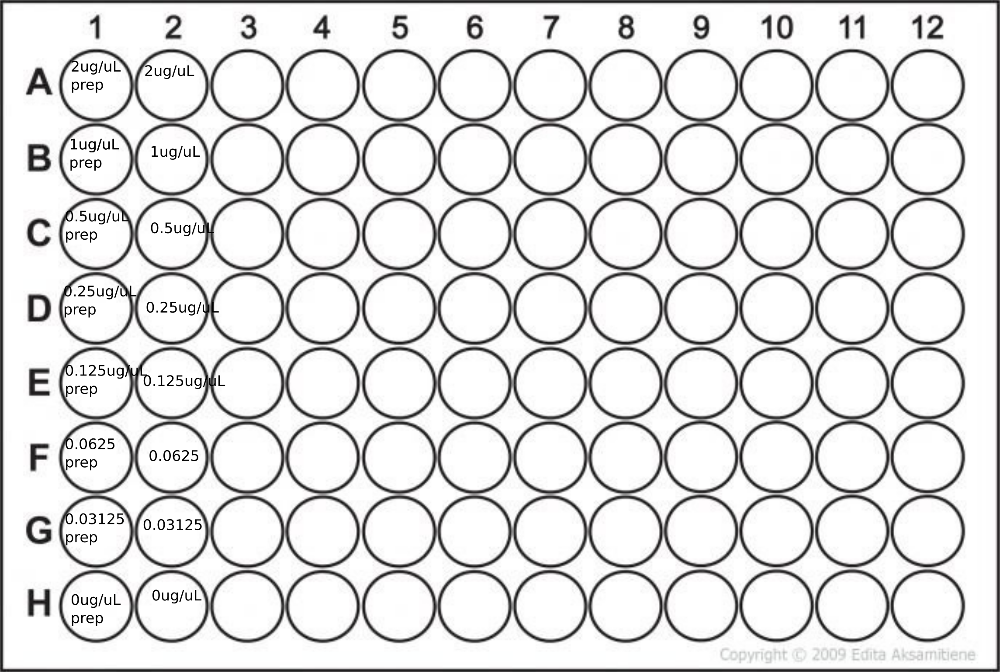

# BCA Protein assay
### Adapted by the Saito lab and written here by Noelle Held; see also associated user's manual

### Materials
* 2uL of each sample to be tested
* 2ug/uL bovine serum albumin solution
* Sample buffer (whatever your sample is dissolved in currently)
* Solutions A, B, and C from kit
* microplate
* microplate sticky cover

### Procedure
* Prepare standards by pipetting 50uL of your sample buffer into all but the first well of a row in the the microplate
* Add 100uL of the BSA solution to the first well of the standard row
* Pipette 50uL from first well into the second well, then switch tip and mix by pipetting, repeat until you are finished with all but the last well (see figure below)
* Prepare kit solution: 250uL A, 240uL B, 10uL C. You will need 40uL per sample to be tested
* Pipette 2uL of your standards into neighboring wells
* Pipette 2uL of your samples to be tested into their wells (fill in the plate template below)
* Add 38uL of the kit solution to each well
* Place sticky cover on plate and vortex gently, then incubate at 37C for 30min - 1 hour (no longer)
* Measure by nanodrop

